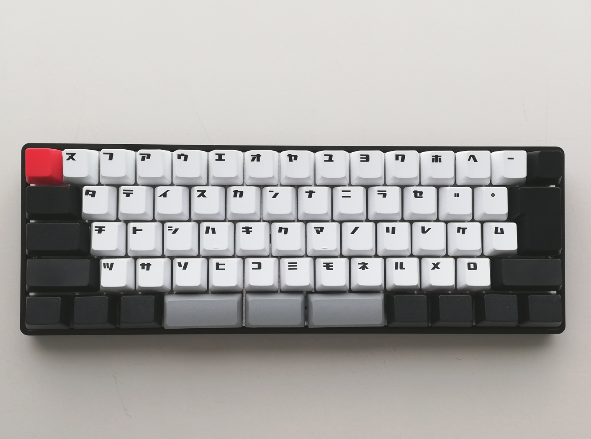

# DZ60 日本語配列 キーマップ

### ・例としてWindows10のWSLでコンパイルするには以下2つのファイルを

#### keymap.c
#### layout_jp.h

### qmk_firmwareをインストールした下記のようなフォルダに設置。

#### ~/qmk_firmware/keyboards/dz60/keymaps/jp/   

### ・~/qmk_firmware/で以下コマンドを実行しコンパイル。

##    make dz60:jp

### 最下段のキーが多い時はlayout_jp.hを修正してください。
